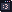
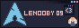

Hello,
I'm a caffeine addict, high school student, and a professional idiot with access to the internet 

btw

---

#### [PGP](pgp)

---

### Games:
Terraria, Stardew valley, Minecraft, Red Dead Redemption 2,
Ready Or Not, No Man's Sky, Ghostrunner, Kingdom Come Deliverance,
BeamNG Drive and BitBurner

---

### People that inspire me:
Theo, Primeagen and PirateSoftware

---

### Stats:

| Stats: | Description |
|---|---|
| Work: | unemployed |
| Side Projects: | 12 |
| Current Project: | Encrypted Communication Protocol & hacking our schools wifi |
| Languages: | Kotlin, Python, C, TypeScript |

---

### Special Thanks:

I would like to give a special thanks to Nanami,
for getting me into Kotlin in the first place.

Another very special thanks to [**Mey**](https://lizainslie.dev) for getting me more connected into the community,
being a great friend and helping me out when I needed it the most. 

---

### Friends:

         

[Mey](https://lizainslie.dev)  [Fryl](https://fryl.dev)   [Luna](https://imlunahey.com)   [H4rl](https://h4rl.dev)
[Luna](https://gxthmxm.com)   [Schtormm](https://schtormm.nl)
[Mia](https://nyanya.gay/@ziku)

[BlueSky List](https://go.bsky.app/Ef9DDKE)

---

# [Testimonials](testamonials/readme.md)

---

## Socials and contact:

| Signal | Discord | ~~Twitter~~ | BlueSky | Last.fm | Anilist | Matrix | E-Mail | KeyBase | Telegram |
|---|---|---|---|---|---|---|---|
| [LeNooby.09](https://signal.me/#eu/NVKWG8sYA6qPwqYvDwxZvZFi8PTNYTvqFtITx0_fEfqP0VkC4fNDU5-Y0zNkSbN9) | [Server](discord) | [~~@LeNooby09~~](https://twitter.com/lenooby09) | [@LeNooby09.tech](https://bsky.app/profile/did:plc:vcias3ih35djy2t3tgjd7rwb) | [@LeNooby09](https://www.last.fm/user/lenooby09) | [@LeNooby09](https://anilist.co/user/LeNooby09/) | [LeNooby09](lenooby09:matrix.org) | contact@lenooby09.tech | [@LeNooby09](https://keybase.io/lenooby09) | @LeNooby09 |

###### Session:
`05ba4c3149c2de3b9a3da4726c6d48b4f41d53282eb73beb80de2dab454b5a0f72`

### [Donate](donate)
please don't, I'm not worth it

---

# Button:

###### [button assets](88x31/readme.md)
